# What : Faceman

My pet is called “Faceman”! It shows facial expressions and players can interact with this pet with several options.

## Menu Selection

Displays `See Pet` option first. The user can use buttons to scroll and select options.

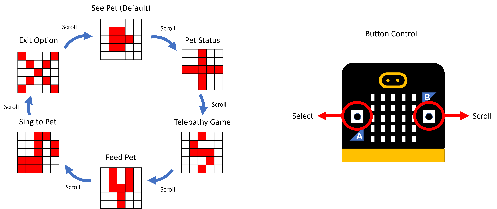

## 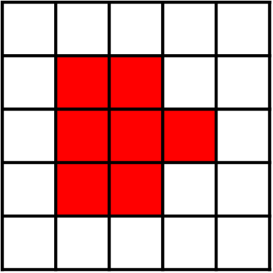 See Pet 

Shows facial expression based on pet's HP and stress.

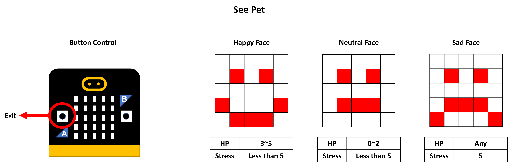

## 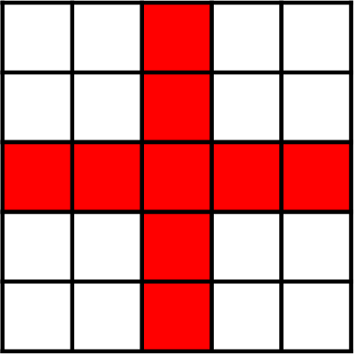 Pet Status 

Shows pet's HP and stress.

## 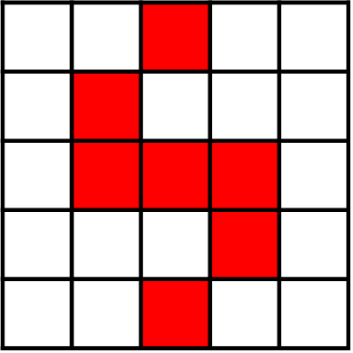 Telepathy Game 

User estimates where the pet wishes to go.

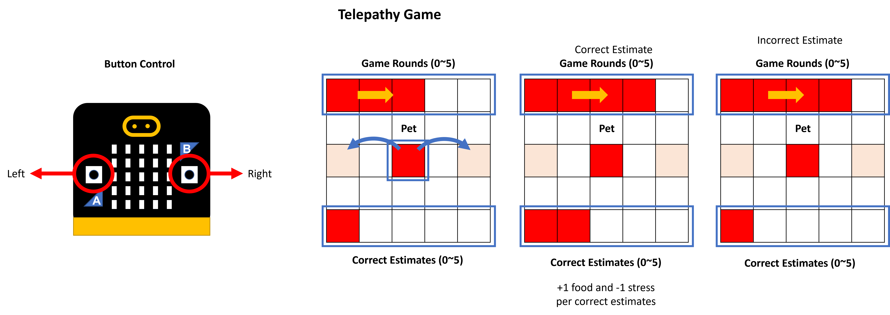

## 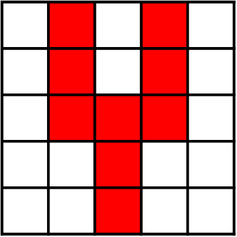 Feed Pet 

User feeds the pet to increase HP if food is available.

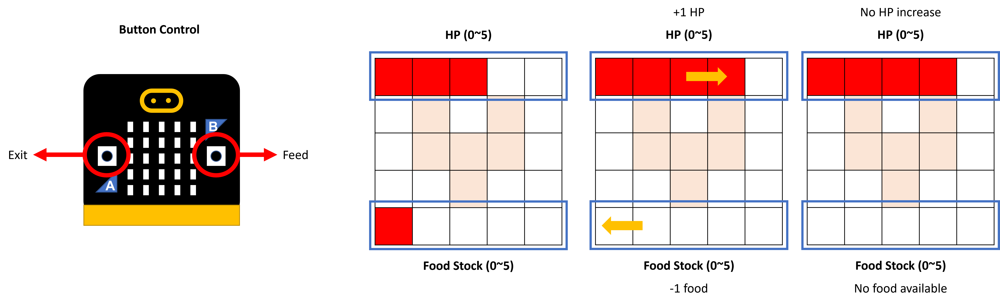

## 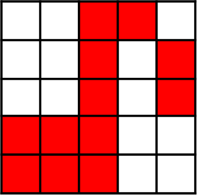 Sing to Pet 

User controls the singing mode to the target singing mode. Game ends until the user gets a maximum score. Pet stress decreases to 0 after the game.

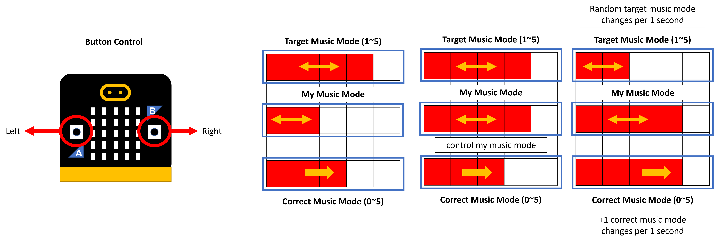

## 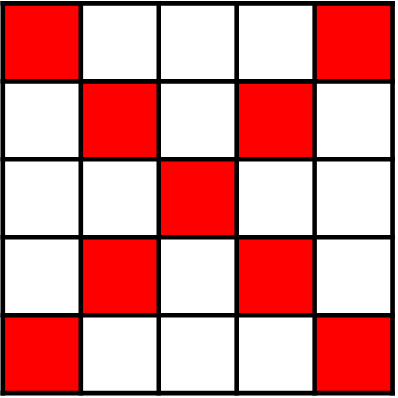 Exit 

Exit to the `See Pet`.

# How : Interaction with Tamagochi 

## Multiple States and Actions

Various libraries with their own purposes were created to organize which functions and data structures are used for each state.

## Selecting Options in Menu

Pre-defined displays of each option are stored with data structure. Users can navigate these options through buttons configured with GPIOTE in `button.S`.

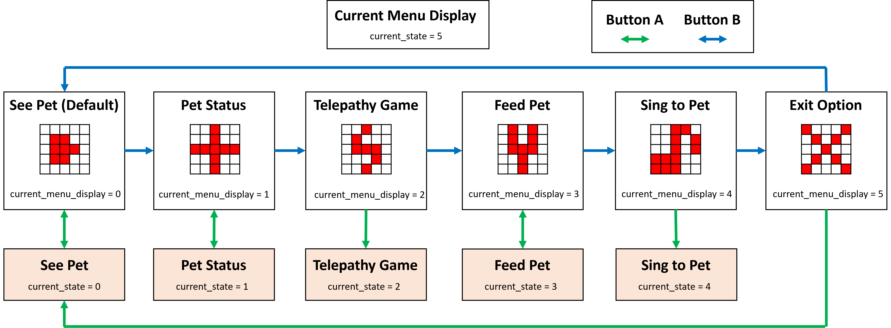

## Displaying Facial Expression, Icon and Status bars

Basically, the function `display` is executed in each loop of the `main.S`. In each loop, `display` reads the data of current state and it would change to corresponding LED display. The `display` also calls necessary functions from custom-built libraries.

## Updating Status Periodically

`SysTick_Handler` periodically interrupts and changes the data structure of the pet status, food stock, etc. Because the handler can count up to 50ms, data structure is used to repeat 20 times of 50ms cycle to make 1 second (basic unit of time).

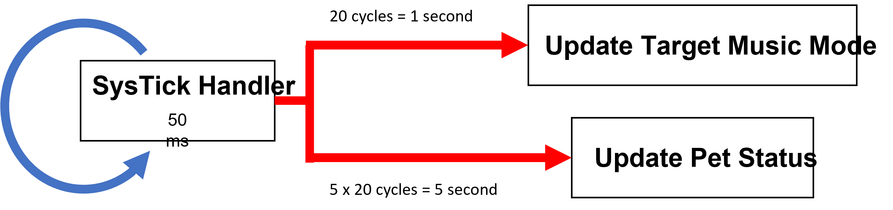

## Button Sound and Synthetic Music

The `audio.S` library is implemented to create audio from speakers. The main loop inputs a certain number to the function `audio_play_sample` to make audio. The audio makes sound if the number is increasing and mutes of the number are constant. Data structure of `button_trigger_sound` is used to control the sound by making a few seconds of sounds or periodically repeating music. 

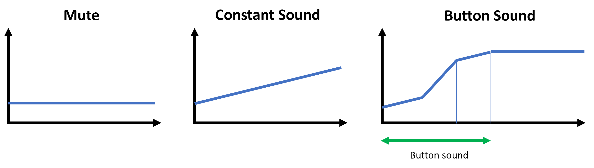

## Random Telepathy, Random Target Music Mode

The random number generator (RNG) module is implemented. The function `generate_random` gets a parameter of inclusive upper bound to calculate a modulus of a generated random number. Once the random module is configured and started, the function can read the random number from the RNG module.

# Why : Reasons for Design and Limitations

## Reasons for Design

Display of the image is done in the main loop because multiple LEDs should be turned on simultaneously. Data structure of predefined images makes the process easier to change the game state and pet status by calling specific functions.

`timer.S` and `buttons.S` implements peripherals to allow a user to interact with the pet. The SysTick handler is used to enable the periodic update of pet status. The period would not be consistent without it.

The button command is sufficiently intuitive to users and easy to catch up what to do. Each button triggers different sounds to notify the user which command has been executed. In a specific state, an unused button is deactivated for simplicity.

## Limitation

`Sing to Pet` can be improved by using a microphone and two independent SysTick handlers.

Instead of buttons, the microphone would record the sound level of the user. The user would gain the score if the sound level is identical to the target sound.

Another independent SysTick handler could have been implemented to evaluate the sound level of the user at the start of the game.

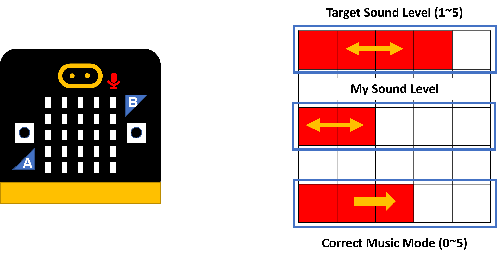