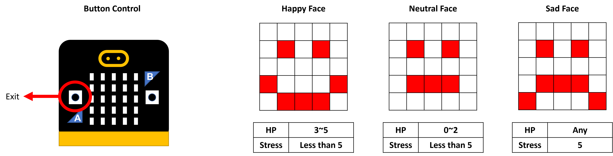

# What : Faceman

My pet is called “Faceman”! It shows facial expressions and players can interact with this pet with several options.

## Menu Selection

Displays `See Pet` option first. The user can use buttons to scroll and select options.

## See Pet

Shows facial expression based on pet's HP and stress.

## Pet Status

Shows pet's HP and stress.

## Telepathy Game

User estimates where the pet wishes to go.

## Feed Pet

User feeds the pet to increase HP if food is available.

## Sing to Pet

User controls singing mode to the target singing mode. Game ends until the user gets a maximum score. Pet stress decreases to 0 after the game.

## Exit 

Exit to the `See Pet`.

# How : Interaction with Tamagochi 

## Multiple States and Actions

Various libraries with their own special purposes were created to organize which functions and data structures are used for each state.

## Selecting Options in Menu

Pre-defined displays of each option are stored with data structure. Users can navigate these options through buttons A and B which are configured with GPIOTE in `button.S`. The block diagram of states is shown in figure 8.

## Displaying Facial Expression, Icon and Status bars

Basically, the function `display` is executed in each loop of the `main.S`. In each loop, `display` reads the data of current state in data structure and it would change the pre-defined LED display. The `display` also calls necessary functions from custom-built libraries.

## Updating status periodically

`SysTick_Handler` is used to periodically interrupt and change the data structure of the pet status, food stock. Because the handler can count a maximum of 50 ms (320,000 cycles), data structure is used to repeat 20 times of 50ms cycle to make 1 second. Update status period is also used to trigger status update by 5 seconds.

## Button sound and synthetic music

The `audio.S` library is implemented to create audio from speakers. The main loop constantly adds an increasing number to function `audio_play_sample` to make audio and add a constant number to mute. Data structure of `button_trigger_sound` is used to control frequency of the sound. This data structure enables the button to make for the button sound of a few seconds or periodically repeating sounds.

## Random Telepathy, Random Target Music Mode

The random number generator (RNG) module is implemented. The function `generate_random` gets a parameter of inclusive upper bound to calculate a modulus of a generated random number. Once the random module is configured and started, the function can read the random number from the RNG module.

# Why : Reasons for Design and Limitations

## Reasons for Design

Display of the image is done in the main loop because multiple LEDs should be turned on simultaneously. Data structure of predefined image is required because it makes it easier to change the state of the game and pet by only calling specific functions.

Peripherals like timer and buttons were implemented to allow a user to interact with the pet. The SysTick handler is used to enable the periodic update of pet status, which is required to set constant time regardless of the code complexity. 

The button command is sufficiently intuitive to users and easy to catch up what to do. For simplicity, button A is used to select/exit/left and button B is used to scroll/action/right. The sound of the command is also implemented to note which command is being executed to the user.

## Limitation

The microphone could have been implemented to improve my design of ‘sing to pet’ part instead of controlling music mode by buttons. The microphone would record the amplitude of the voice of the user. The user would gain the score if the user makes a similar level of the target sound.